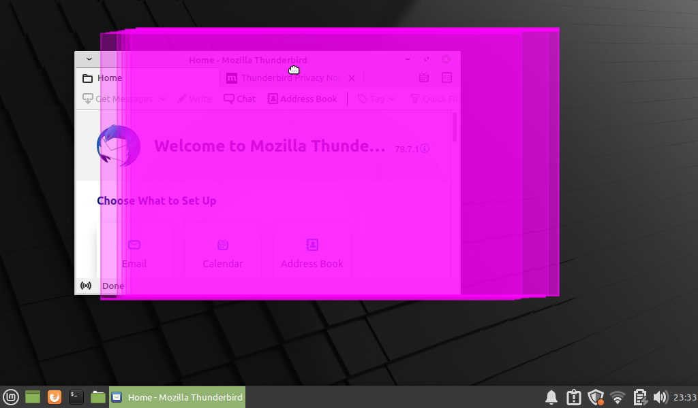
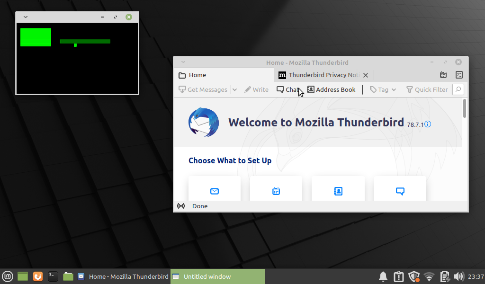

# xdamageviz

A linux x11 app to visualize display updates of x11 applications.

## Introduction
The x11 xdamage extension (see https://www.x.org/releases/X11R7.5/doc/damageproto/damageproto.txt)
notifies subscribers when screen content is not valid - or - "damaged". This is useful for e.g. automatic screen recording tools, vnc clients and 
other tools that need to know when changes happened to the screen content. xdamageviz is a debugging tool that
visualizes this information in a way that allows the developer to better understand *what* is updated and *when*.

## Install

Following development headers are required to build the app:

* libx11-dev
* libXdamage-dev 
* libcairo2-dev
* libpthread-dev

A cmake file is included, so building should be as simple as:

```
cmake
make
```

## Run

xdamageviz provides a set of command line options to customize the visualization and other parameters. 

```
> ./xdamageviz
```

The following options are supported.

```
-d, --display <display>   the display to use
-w, --width <width>   width of the visualization (default is display width)
-h, --height <height>   height of the visualization (default is display height)
-f, --fps <frames per second>   number of frames per second (default is 30)
-n, --no-decoration    removes decoration from window
-a, --color-fg <foreground color>   sets foreground color of visualization (default is #FFFFFFFF)
-b, --color-bg <background color>   sets background color of visualization (default is #000000FF)
--help,    prints help
```

## Examples

Run fullscreen with transparent background and 15fps.
```
./xdamageviz --fps=30 --color-bg=#00000000 --color-fg=#FF00FF88 --no-decoration
```




Run in window with opaque black background color, green foreground color and a canvas width of 256x150px.  
```
./xdamageviz --fps=30 --color-bg=#000000FF --color-fg=#00FF00FF --width=256 --height=150 
```



## Disclaimer and notes

This is a tool built for the sole purpose to help understand the xdamage extension and how X11 updates are
carried out over time. The developer is not an experienced C nor X11 developer so there are definitely many 
bugs in the code. Don't rely on it! If it helps you somehow - very good! that is why it was put here.

## License

Copyright (c) 2021 @martin19

Permission is hereby granted, free of charge, to any person obtaining
a copy of this software and associated documentation files (the
"Software"), to deal in the Software without restriction, including
without limitation the rights to use, copy, modify, merge, publish,
distribute, sublicense, and/or sell copies of the Software, and to
permit persons to whom the Software is furnished to do so, subject to
the following conditions:

The above copyright notice and this permission notice shall be
included in all copies or substantial portions of the Software.

THE SOFTWARE IS PROVIDED "AS IS", WITHOUT WARRANTY OF ANY KIND,
EXPRESS OR IMPLIED, INCLUDING BUT NOT LIMITED TO THE WARRANTIES OF
MERCHANTABILITY, FITNESS FOR A PARTICULAR PURPOSE AND
NONINFRINGEMENT. IN NO EVENT SHALL THE AUTHORS OR COPYRIGHT HOLDERS BE
LIABLE FOR ANY CLAIM, DAMAGES OR OTHER LIABILITY, WHETHER IN AN ACTION
OF CONTRACT, TORT OR OTHERWISE, ARISING FROM, OUT OF OR IN CONNECTION
WITH THE SOFTWARE OR THE USE OR OTHER DEALINGS IN THE SOFTWARE.

